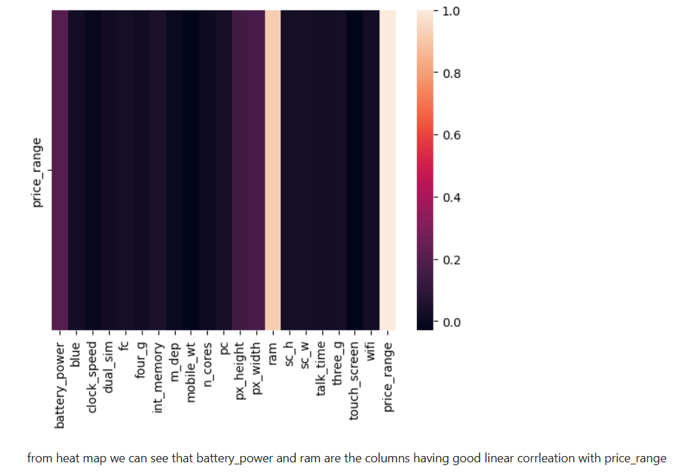
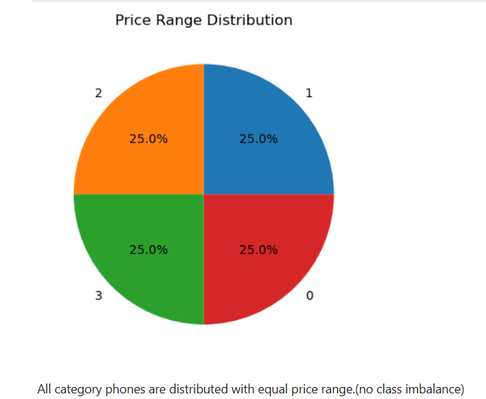
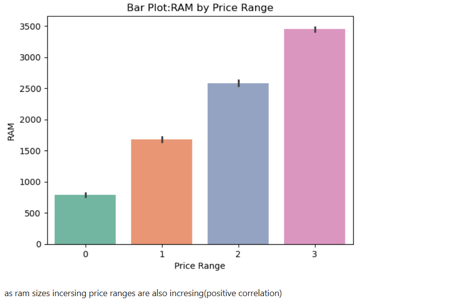
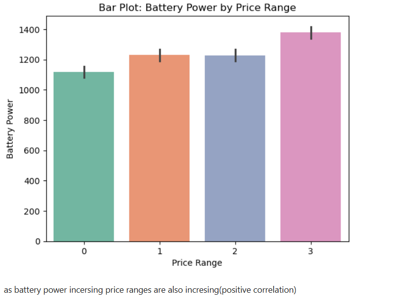
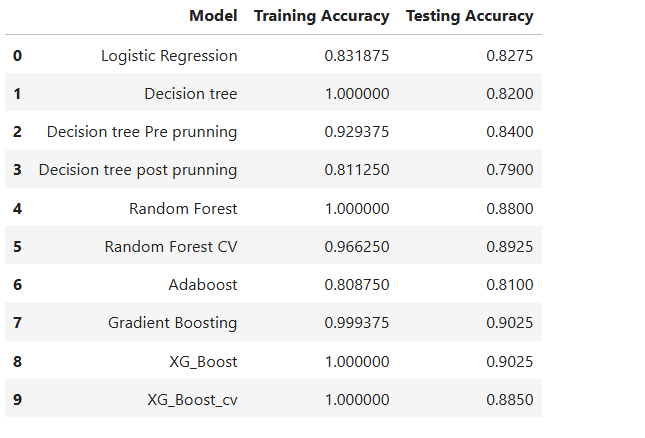

# Mobile Price Range Classification (Machine Learning)

## Overview

This project is a machine learning classification system developed to predict mobile phone price ranges based on different mobile specifications such as RAM, battery power, internal memory, camera quality, display resolution, and processor-related features.

The project focuses on comparing multiple machine learning algorithms and selecting the best-performing model based on evaluation metrics and overall classification performance.

AdaBoost Classifier was finalized as the optimal model after comparing it with multiple classification algorithms.

---

## Objectives

- Predict mobile phone price ranges using classification algorithms
- Perform exploratory data analysis (EDA) to identify important pricing factors
- Compare multiple machine learning models
- Evaluate models using classification metrics
- Identify features that strongly influence mobile pricing
- Build a clean end-to-end machine learning workflow

---

## Dataset Information

Dataset contains mobile specifications such as:
- Battery Power
- RAM
- Internal Memory
- Mobile Weight
- Pixel Height & Width
- Processor Cores
- Front Camera
- Primary Camera
- Clock Speed
- Dual SIM Support
- 3G/4G Support
- Touch Screen Support
- WiFi Support

Target Variable:
- Price Range

Price Range Categories:
- 0 → Low Cost
- 1 → Medium Cost
- 2 → High Cost
- 3 → Very High Cost

Dataset Characteristics:
- Balanced target classes
- No major missing values
- Structured numerical dataset suitable for classification

---

## Project Workflow

### 1. Data Understanding
- Checked dataset structure
- Explored feature distributions
- Analyzed statistical summaries

### 2. Data Cleaning & Preprocessing
- Checked missing values
- Verified duplicate records
- Performed preprocessing using Pandas and NumPy
- Prepared clean input data for model training

### 3. Exploratory Data Analysis (EDA)
- Correlation analysis
- Distribution analysis
- Feature relationship analysis
- Outlier understanding
- Target class distribution analysis

### 4. Feature Analysis
- RAM vs Price Range analysis
- Battery Power impact analysis
- Correlation heatmap interpretation
- Feature importance understanding

### 5. Model Building
Implemented and compared multiple machine learning algorithms:
- Logistic Regression
- K-Nearest Neighbors (KNN)
- Decision Tree Classifier
- Random Forest Classifier
- AdaBoost Classifier

### 6. Model Evaluation
Evaluated models using:
- Accuracy Score
- Precision
- Recall
- F1-Score
- Confusion Matrix

---

## Final Model

### AdaBoost Classifier

AdaBoost achieved the best overall performance among all evaluated models.

### Final Accuracy
```text
80.88%
```

---

## Libraries Used

```python
import pandas as pd
import numpy as np
import matplotlib.pyplot as plt
import seaborn as sns

from sklearn.model_selection import train_test_split
from sklearn.metrics import accuracy_score
from sklearn.ensemble import AdaBoostClassifier
```

---

## Key Insights

- RAM showed a strong relationship with mobile pricing.
- Battery power significantly influenced price categories.
- Higher RAM devices were generally associated with premium price ranges.
- The dataset had balanced class distribution, reducing class imbalance issues.
- AdaBoost outperformed several traditional classification algorithms.

---

## Project Screenshots

### Correlation Heatmap


---

### Price Range Distribution


---

### RAM vs Price Range Analysis


---

### Battery Power vs Price Range Analysis


---

### Model Comparison


---

## Learnings

- Compared multiple classification algorithms
- Improved understanding of ensemble learning methods
- Performed exploratory data analysis using visualization libraries
- Worked with preprocessing and model evaluation workflows
- Understood feature influence on pricing predictions
- Built an end-to-end machine learning classification project
